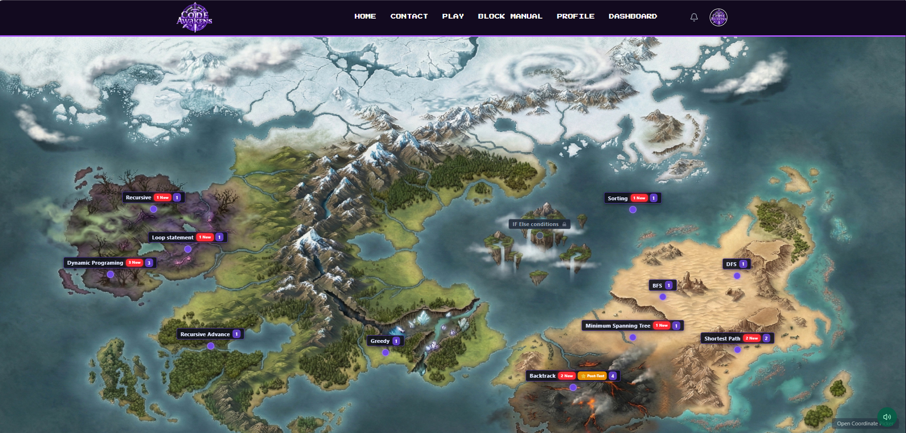
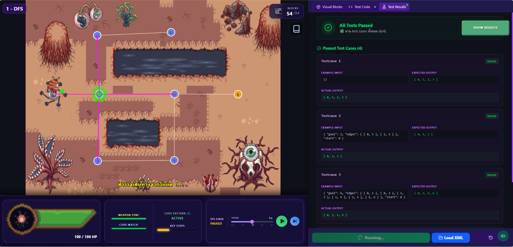
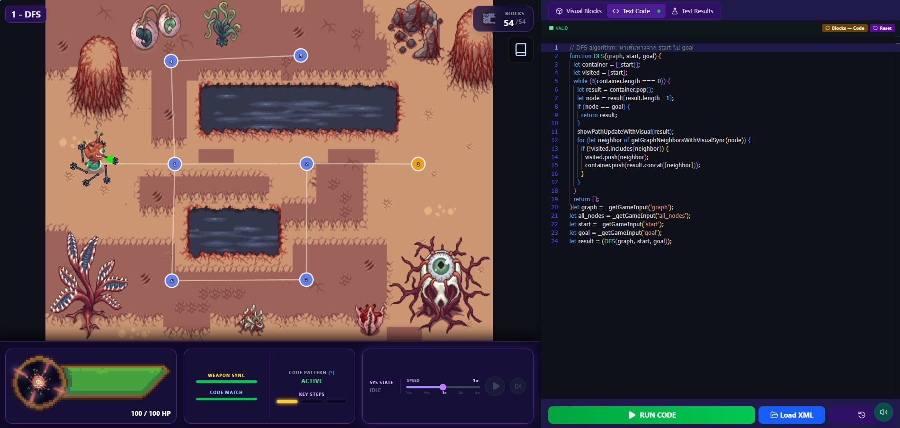
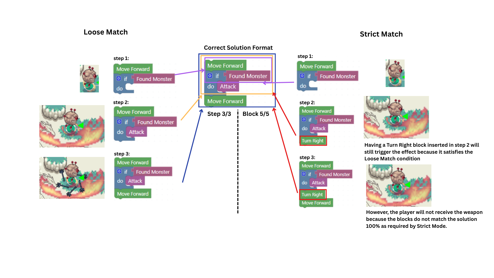
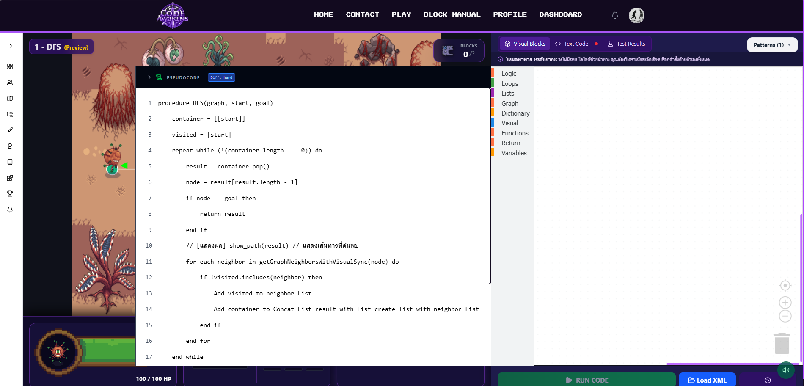
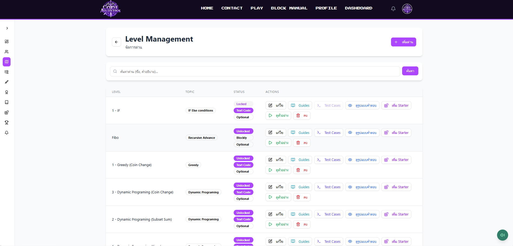
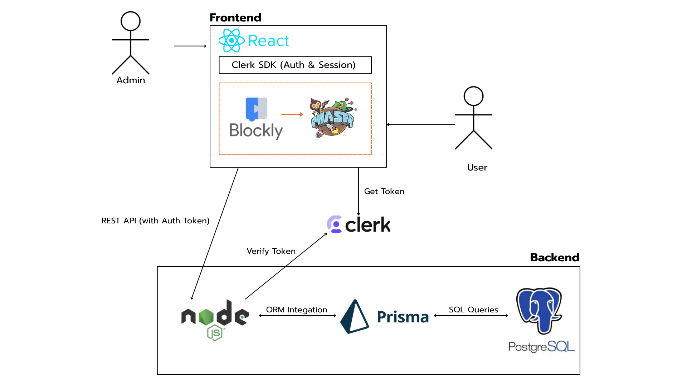
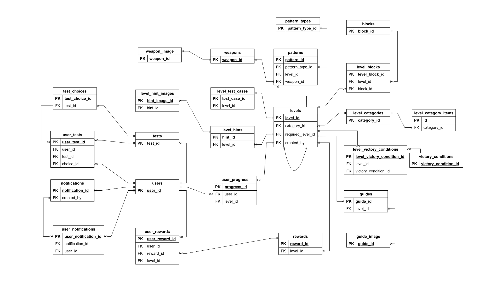
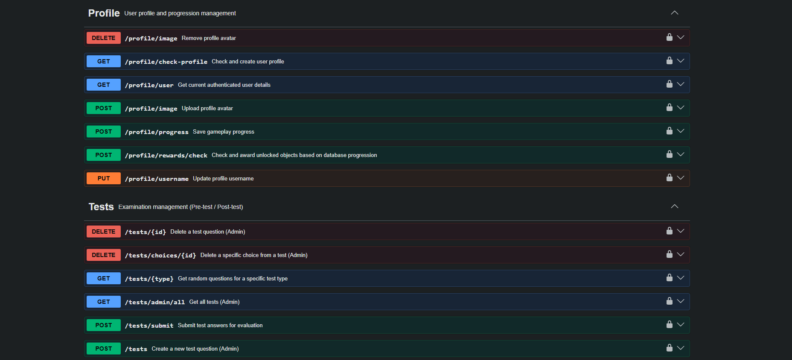

# Code Awakens

A full-stack gamified e-learning platform that teaches algorithm and data structure concepts through interactive 2D gameplay. Students write logic using drag-and-drop visual blocks (Google Blockly) and immediately see the results play out in a real-time Phaser.js game engine — bridging the gap between abstract theory and tangible understanding.

The platform covers a wide range of topics: basic control flow (`if/else`, loops, recursion), classic sorting (Bubble Sort), graph traversal (DFS, BFS, Dijkstra, Prim, Kruskal), dynamic programming (Knapsack, Subset Sum, Coin Change), and backtracking (N-Queens).

> **Live Demo:** [https://codeawakens-client.vercel.app/](https://codeawakens-client.vercel.app/)
> Try the demo level on the landing page — no login required.

<!-- Insert: gameplay screenshot or GIF of the main game screen -->








---

## Tech Stack

| Layer                  | Technology                                                          |
| ---------------------- | ------------------------------------------------------------------- |
| **Frontend**           | React 19, Vite, TailwindCSS, Zustand, TanStack Query, Framer Motion |
| **Game Engine**        | Phaser.js 3 (HTML5 Canvas / WebGL)                                  |
| **Visual Programming** | Google Blockly 12 + Monaco Editor (Text Code mode)                  |
| **Backend**            | Node.js, Express, Prisma ORM, Swagger (API Docs)                    |
| **Authentication**     | Clerk (OAuth, Session Management)                                   |
| **Database**           | PostgreSQL                                                          |
| **Infrastructure**     | Docker, Nginx (Reverse Proxy)                                       |
| **Testing**            | Vitest, Supertest                                                   |

---

## Key Features

### Game-Based Learning

- 2D pixel-art game powered by Phaser.js with sprite animations, combat mechanics, and pathfinding challenges.
- Students control a character by assembling code blocks — each block translates to real JavaScript executed in a sandboxed environment.
- Progressive difficulty: **Easy** (floating guide blocks + starter blocks + pseudocode highlights) → **Medium** (no floating blocks, Only starter blocks toolblocks + Pseudocode highlights) → **Hard** (Only toolblocks).

### Supported Algorithm Topics

| Category                | Topics                                           |
| ----------------------- | ------------------------------------------------ |
| **Fundamentals**        | If/Else branching, Loops (for, while), Recursion |
| **Sorting**             | Bubble Sort                                      |
| **Graph Traversal**     | DFS, BFS                                         |
| **Shortest Path & MST** | Dijkstra, Prim, Kruskal                          |
| **Dynamic Programming** | 0/1 Knapsack, Subset Sum, Coin Change            |
| **Backtracking**        | N-Queens                                         |

Each algorithm has dedicated game levels with step-by-step visual playback — students can watch their code traverse a graph node-by-node or build a DP table step-by-step.

### Visual Programming Engine

- Google Blockly workspace with custom block definitions for movement, combat, loops, functions, and algorithm-specific operations (DFS traversal, backtracking placement, etc.).
- Real-time code generation: blocks compile to executable async JavaScript with `await`-based sequencing for frame-accurate game animations.
- Side-by-side **Blocks → Code** view lets students see the JavaScript equivalent of their visual program.
- In **Text Code mode**, the system validates that the typed code matches the generated block output line-by-line before allowing Run — bridging visual and syntax programming.

### Scoring & Pattern Analysis

**Pattern Matching**

On every block change, the system DFS-traverses the Blockly workspace to flatten the block tree into a 1D array, then compares it against the instructor-defined answer pattern in two modes:

- **Loose Match** — Blocks are compared step-by-step; extra or out-of-order blocks are skipped. Partial matches unlock weapon effects progressively as the student builds toward a solution.
- **Strict Match** — The workspace must match the pattern 100% (checked by Type, Depth, `varName`, and Fields). Only a full match unlocks the weapon reward.

Legacy levels support up to 2 answer patterns; Algorithm levels allow only 1. The answer pattern is cached at level load to avoid re-parsing XML on every comparison.

<!-- Insert: pattern matching diagram (Loose vs Strict match with step breakdown) -->



**Big-O Assessment**

Students select the Big-O complexity of their solution from a list; the server checks whether the selection matches the expected complexity set by the instructor for that level.

**Scoring Breakdown**

| Condition                    | Points |
| ---------------------------- | ------ |
| Pass level win condition     | +60    |
| Pattern match — medium level | +20    |
| Pattern match — good level   | +40    |
| Big-O selection incorrect    | −20    |

Star ratings: ≥ 1 pt = ⭐ · > 60 pts = ⭐⭐ · > 80 pts = ⭐⭐⭐

**Weapon Reward System**

Achieving a Strict Match on the answer pattern unlocks an in-game weapon with a visual animation effect — directly tying code quality to in-game progression.

### Pseudocode Hint System

Each level can include a pseudocode overlay that maps algorithm steps to corresponding Blockly blocks. The hint behavior adapts to the difficulty of the level:

| Difficulty | Floating block hint                | Connected block hint                |
| ---------- | ---------------------------------- | ----------------------------------- |
| Easy       | Highlights the next block to place | Highlights matching pseudocode line |
| Medium     | None                               | Highlights matching pseudocode line |
| Hard       | None                               | No highlight shown                  |

The system uses **LCS (Longest Common Subsequence)** on the block's `ancestorStr` (the chain of parent block types from root to current block) to determine which pseudocode line the student is currently working on — tolerating reordering and partial completion without breaking the match.

<!-- Insert: pseudocode hint screenshot (3-column comparison: Easy floating / Easy connected / Medium) -->

Easy Pseudocode Hint


Medium Pseudocode Hint


Hard Pseudocode Hint



### Pre/Post Assessment & Adaptive Unlocking

- Built-in **Pre-Test / Post-Test** system with multiple-choice and image-based questions (15 questions, randomised by difficulty tier).
- **Adaptive unlocking:** Pre-Test score determines which zone of levels unlocks immediately:

| Score    | Zone unlocked         |
| -------- | --------------------- |
| ≥ 80%    | Zone C (advanced)     |
| 50 – 79% | Zone B (intermediate) |
| < 50%    | Zone A (beginner)     |

- Post-Test is gated behind completing the required levels; results are compared against Pre-Test scores to measure learning gain.

### Admin Dashboard (Level Editor / CMS)

- Visual node-based map editor for designing levels with custom coordinates, monsters, items, and pathways.
- Block permission system: admins select which Blockly blocks are available per level.
- Pattern editor for defining answer patterns (with Loose/Strict step breakdown), pseudocode hints, and hidden test cases.
- Analytics dashboard with charts for tracking student progress, completion rates, and score distributions.



### Role-Based Access Control

- **Player** — Gameplay, progress tracking, rewards, pre/post assessments.
- **Admin** — Full CMS access: level creation, user management, notifications, test management.

Authentication is handled by Clerk SDK; backend verifies tokens via `@clerk/express` middleware.

---

## Architecture & Data Flow

<!-- Insert: System Architecture diagram (from slide — React / Clerk SDK / Blockly → Phaser / Node → Prisma → PostgreSQL) -->



### How Code Execution Works

When the student clicks **Run Code**, execution differs by level type:

**Legacy levels** (movement / combat)

1. Blocks are compiled to async JavaScript strings.
2. The system checks there are no floating (unconnected) blocks.
3. Code runs via `new AsyncFunction` with game functions injected as context (`moveForward()`, `turnLeft()`, `hit()`, etc.).
4. Phaser Tween animations play **in real time** as each `await` resolves.
5. After code finishes, win conditions are checked; result is saved to the database.

**Algorithm levels** (DFS, DP, Backtracking, etc.)

1. Same compilation and context injection, but algorithm-specific trace functions are injected instead (`trackVisit()`, `trackFiboDecision()`, etc.) — no animations during execution.
2. Code runs and produces a **Trace Array** of step objects (e.g. `{ type, action, n, value }`).
3. Trace is validated against hidden test cases.
4. If all test cases pass, the system **plays back** the trace as step-by-step animations (node expansion, DP table fill, etc.).
5. Result is saved to the database.

Both modes wrap execution in `Promise.race` with a 5-second timeout to catch infinite loops.

---

## Database Schema (Key Models)

<!-- Insert: ER Diagram -->



| Model                 | Purpose                                                        |
| --------------------- | -------------------------------------------------------------- |
| `User`                | Player/Admin accounts (linked to Clerk)                        |
| `Level`               | Game levels with nodes, edges, map entities, starter XML       |
| `Pattern`             | Answer patterns with Big-O classification and pseudocode steps |
| `UserProgress`        | Per-user level completion, scores, attempts                    |
| `Weapon`              | In-game rewards with sprite animations                         |
| `LevelTestCase`       | Hidden test cases for algorithm levels                         |
| `Test` / `TestChoice` | Pre/Post assessment questions and choices                      |

Full schema: [`server/prisma/schema.prisma`](./server/prisma/schema.prisma)

---

## Local Setup

### Prerequisites

- [Docker](https://docs.docker.com/get-docker/) & Docker Compose
- A [Clerk](https://clerk.com) account (free tier) for authentication keys

### 1. Clone & Configure

```bash
git clone https://github.com/Enjoyer123/codeawakens_project.git
cd codeawakens_project
```

Create a `.env` file in the project root:

```env
# Database
POSTGRES_USER=postgres
POSTGRES_PASSWORD=your_password
POSTGRES_DB=codeawakens

# Clerk Authentication
CLERK_PUBLISHABLE_KEY=pk_test_xxxxx
CLERK_SECRET_KEY=sk_test_xxxxx
VITE_CLERK_PUBLISHABLE_KEY=pk_test_xxxxx

# URLs
CLIENT_URL=http://localhost
VITE_API_URL=/api
```

### 2. Build & Run

```bash
docker-compose up --build -d
```

This starts 4 containers:

| Container | Role          | Port             |
| --------- | ------------- | ---------------- |
| `db`      | PostgreSQL 15 | 5432 (internal)  |
| `server`  | Express API   | 4000 (internal)  |
| `client`  | React (Vite)  | 5173 (internal)  |
| `nginx`   | Reverse Proxy | **80** (exposed) |

### 3. Initialize Database

```bash
docker-compose exec server npx prisma migrate deploy
docker-compose exec server npx prisma db seed
```

### 4. Access

Open [http://localhost](http://localhost) in your browser.
API documentation: [http://localhost/api/api-docs](http://localhost/api/api-docs)



---

## Useful Commands

```bash
# View running containers
docker-compose ps

# Follow server logs
docker-compose logs -f server

# Rebuild a specific service
docker-compose up -d --build server

# Run backend tests
docker-compose exec server npm test

# Stop all containers (preserve data)
docker-compose down

# Stop all containers (reset database)
docker-compose down -v
```

---

## Known Limitations

- **No dynamic block/condition creation from Admin Panel** — adding a new block type or win condition requires editing source code directly; it cannot be done from the CMS.
- **No real-time block state persistence** — if the browser crashes mid-session, the current block layout is lost. The last _submitted_ attempt is saved, but in-progress work is not.

### Planned Improvements

- Real-time block state autosave so students can resume from exactly where they left off.
- Export a student's block solution as runnable JavaScript or Python source code.

---

## About

**Code Awakens** was developed as a senior capstone project (ปริญญานิพนธ์) at the **Department of Computer Science and Information, King Mongkut's University of Technology North Bangkok (KMUTNB)**, Academic Year 2568 (2025–2026).

**Awarded Best Presentation** at _Science Exhibition Day 2026_.

### Authors

- **Anocha Sitthichot** (อโนชา สิทธิโชติ)
- **Thippatai Kongpayung** (ธิปไตย ก๋งพยุง)

---

_This project was developed as a senior capstone. All rights reserved._
